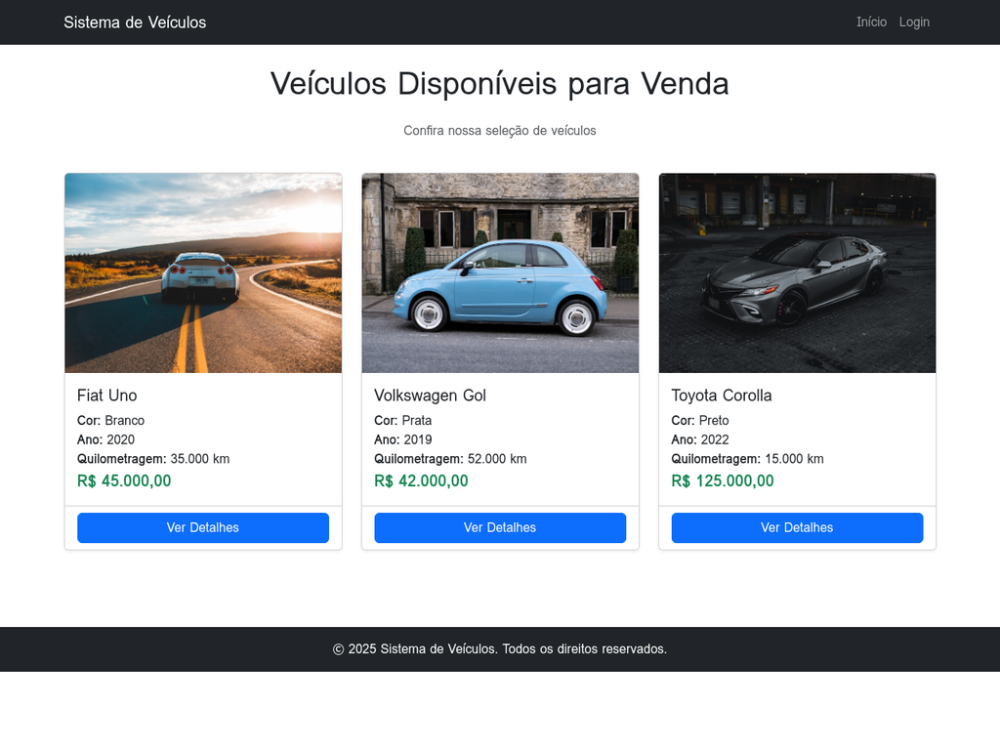
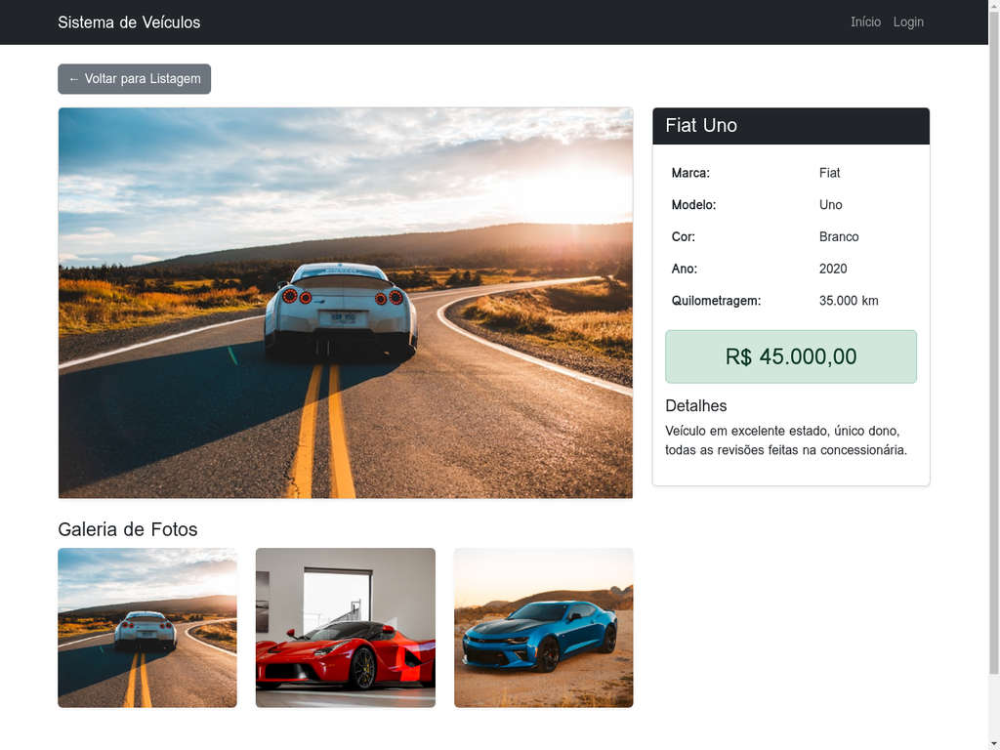
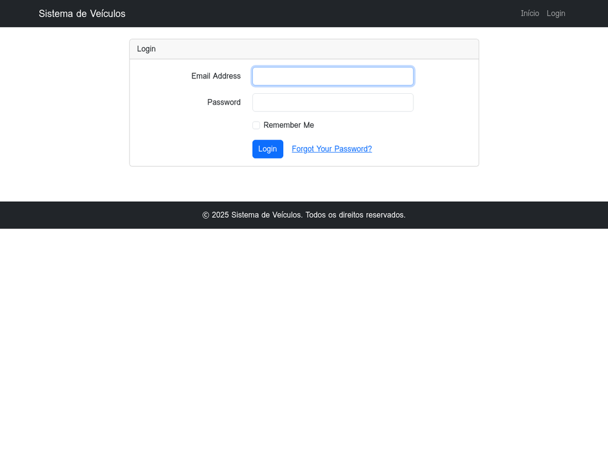
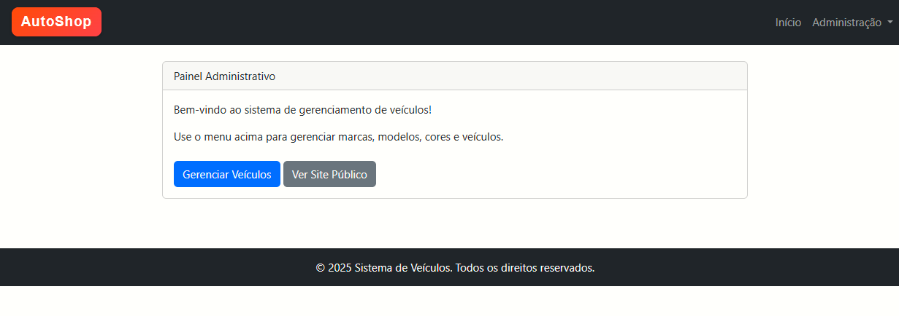
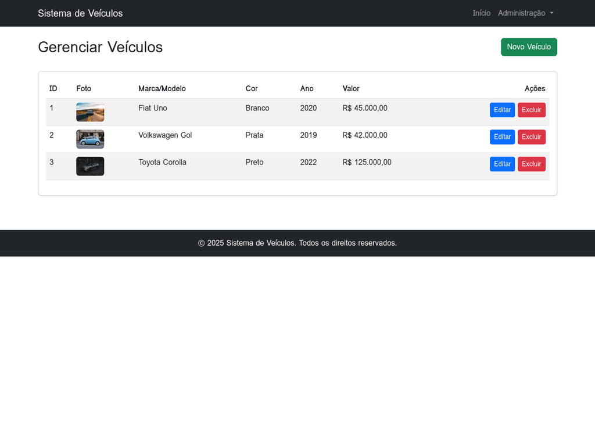
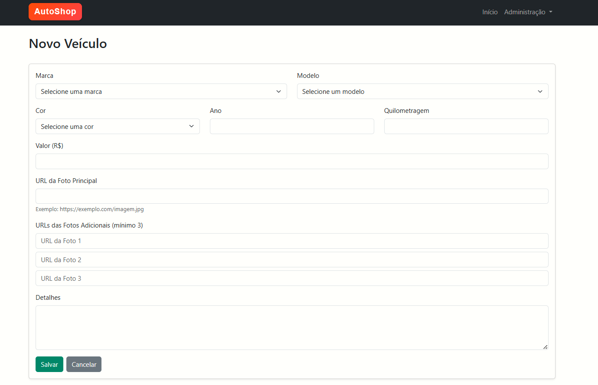
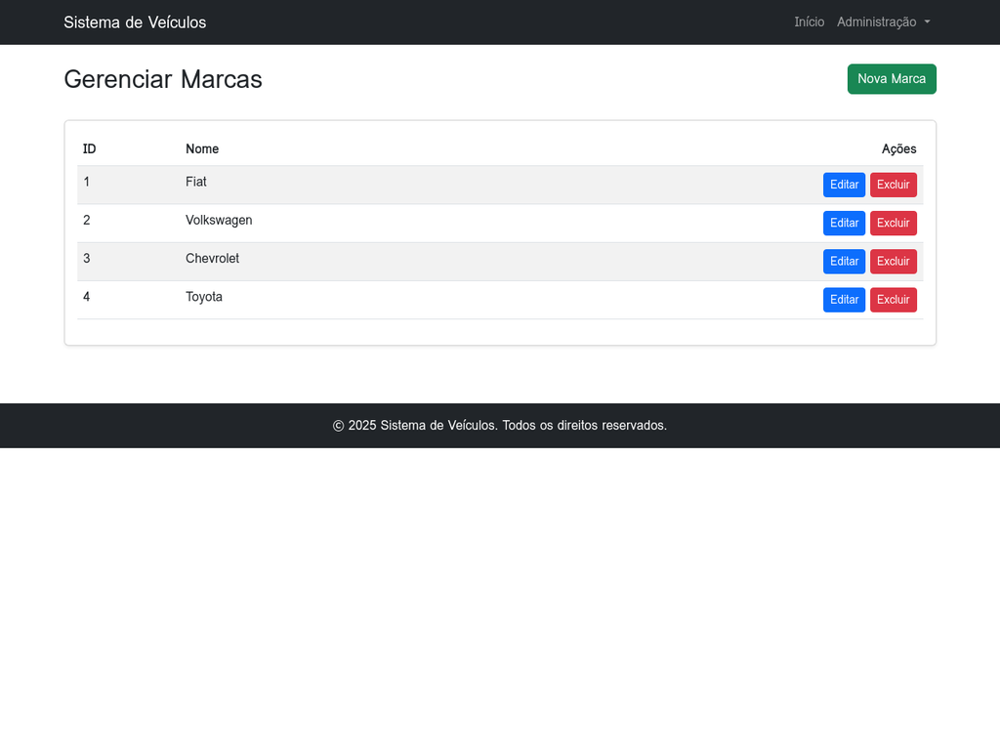
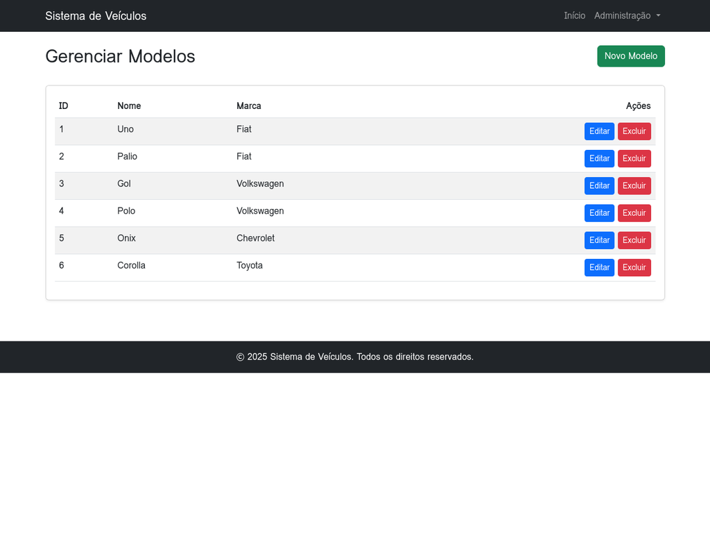
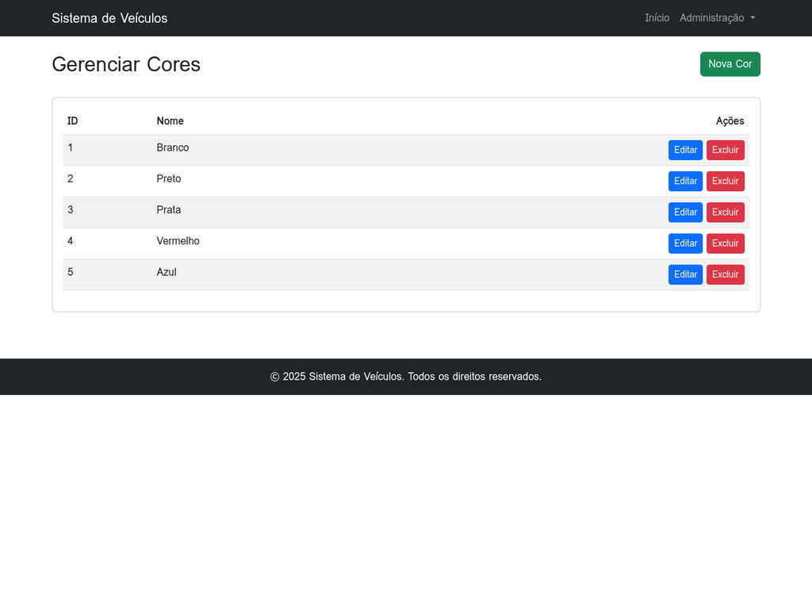

<<<<<<< HEAD
# Sistema de Venda de Veículos

Sistema desenvolvido em Laravel para gerenciamento e visualização de veículos à venda, similar aos portais Carros.com.br, iCarros e Webmotors.

## 📋 Requisitos

- PHP 8.1 ou superior
- MySQL 5.7 ou superior
- Composer
- XAMPP (ou servidor web com PHP e MySQL)

## 🚀 Instalação

### 1. Configurar o XAMPP

1. Inicie o XAMPP Control Panel
2. Inicie os serviços **Apache** e **MySQL**

### 2. Criar o Banco de Dados

1. Acesse o phpMyAdmin: `http://localhost/phpmyadmin`
2. Crie um novo banco de dados chamado `sistema_veiculos`
3. Não é necessário criar tabelas, as migrations farão isso automaticamente

### 3. Extrair os Arquivos

1. Extraia o arquivo ZIP do projeto
2. Copie a pasta `sistema-veiculos` para dentro da pasta `htdocs` do XAMPP
   - Caminho completo: `C:\xampp\htdocs\sistema-veiculos` (Windows)
   - Ou: `/opt/lampp/htdocs/sistema-veiculos` (Linux)

### 4. Configurar o Arquivo .env

O arquivo `.env` já está configurado com as seguintes credenciais padrão do XAMPP:

```
DB_CONNECTION=mysql
DB_HOST=127.0.0.1
DB_PORT=3306
DB_DATABASE=sistema_veiculos
DB_USERNAME=root
DB_PASSWORD=
```

**Importante:** Se você configurou uma senha para o MySQL no XAMPP, altere a linha `DB_PASSWORD=` para incluir sua senha.

### 5. Instalar Dependências

Abra o terminal/prompt de comando na pasta do projeto e execute:

```bash
composer install
```

### 6. Executar as Migrations e Seeders

No terminal, execute os seguintes comandos:

```bash
# Executar as migrations (criar tabelas)
php artisan migrate

# Executar os seeders (popular com dados de exemplo)
php artisan db:seed
```

### 7. Acessar o Sistema

Abra o navegador e acesse:

- **Área Pública:** `http://localhost/sistema-veiculos/public`
- **Login Administrativo:** `http://localhost/sistema-veiculos/public/login`

## 🔐 Credenciais de Acesso

### Administrador

- **E-mail:** admin@admin.com
- **Senha:** admin123

## 📂 Estrutura do Sistema

### Área Pública

A área pública permite que visitantes visualizem todos os veículos disponíveis para venda, com as seguintes informações:

- Foto principal
- Marca e modelo
- Cor
- Ano de fabricação
- Quilometragem
- Valor
- Detalhes do veículo

Ao clicar em um veículo, é exibida uma página de detalhes com todas as informações e galeria de fotos.

### Área Administrativa

A área administrativa é restrita ao administrador autenticado e permite:

- **Gerenciar Marcas:** Criar, editar e excluir marcas de veículos
- **Gerenciar Modelos:** Criar, editar e excluir modelos vinculados às marcas
- **Gerenciar Cores:** Criar, editar e excluir cores disponíveis
- **Gerenciar Veículos:** Criar, editar e excluir veículos com todas as informações

Cada veículo deve ter:
- Mínimo de 3 fotos (armazenadas como URLs)
- Campos obrigatórios: ano, quilometragem e valor
- Campos opcionais: detalhes (descrição)

## 🛠️ Tecnologias Utilizadas

- **Framework:** Laravel 10
- **Frontend:** Bootstrap 5 (via CDN)
- **Banco de Dados:** MySQL
- **Autenticação:** Laravel UI (Bootstrap)
- **Template Engine:** Blade

## 📸 Screenshots

### Tela Inicial (Área Pública)


### Detalhes do Veículo


### Login


### Painel Administrativo


### Gerenciar Veículos


### Cadastrar Veículo


### Gerenciar Marcas


### Gerenciar Modelos


### Gerenciar Cores


## 🔧 Comandos Úteis

### Limpar Cache

```bash
php artisan cache:clear
php artisan config:clear
php artisan route:clear
php artisan view:clear
```

### Recriar o Banco de Dados

Se precisar resetar o banco de dados:

```bash
php artisan migrate:fresh --seed
```

**Atenção:** Este comando apaga todos os dados e recria as tabelas com dados de exemplo.

## 📝 Observações

- As imagens dos veículos são armazenadas como URLs (links externos), não há upload de arquivos
- O sistema utiliza templates Blade com `@extends`, `@section` e `@yield` conforme solicitado
- Todas as validações de formulário estão implementadas
- O sistema está preparado para funcionar em ambiente local (XAMPP)

## 👨‍💻 Desenvolvimento

Este projeto foi desenvolvido como trabalho acadêmico utilizando as melhores práticas do Laravel, mantendo a simplicidade e clareza do código para fins educacionais.

## 📄 Licença

Este projeto é de uso acadêmico.
=======
# TrabalhoLPWEBII
Site de vendas automotivas 
>>>>>>> fb02c14a695117331ac1bc89ea0450f0b8ecd095
